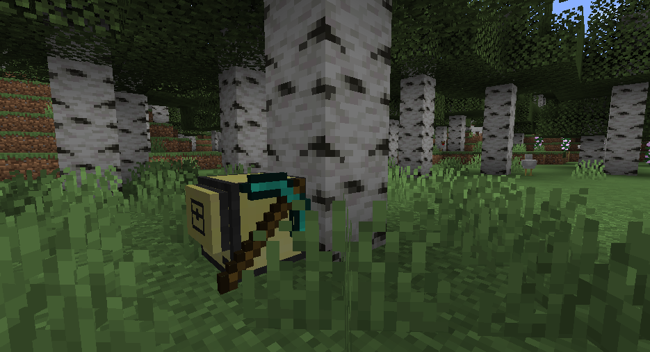

# Replicating Robots

My attempt at the "self-replicating turtle" for the Computer Craft mod in Minecraft.

This mod is where my ~~addiction~~ passion for programming began (back in 2012) so I thought I'd pay homage and complete this more complex challenge.

## Context

ComputerCraft is a mod for Minecraft, which adds Lua programmable robots to the game.

The robots are very primitive by default, only exposing a basic API for interacting with the world (`move`, `dig`, `inspect`, ...)

With the right programming, the robot can achieve anything a normal player could.

In this challenge, you program a robot to collect enough resources to create a clone of itself.

## Challenge

[Set back in 2012 in the ComputerCraft forums.](http://www.computercraft.info/forums2/index.php?/topic/4462-competition/)

### Rules

- Turtle must acquire all the resources it needs to operate by itself
- Turtle must place a torch near its starting location by full dark
- Turtle must check this torch before nightfall every day, and replace it if missing
- Turtle must acquire all the resources required to build additional crafty mining turtles.
- Must craft two crafty mining turtles, and place them in a chest near the starting location.
- Must place a sign over that chest reading "Complete" when and only when this goal has been met.
- These turtles will be removed by the judge when the "Complete" sign is found.

### Setup

- A crafty mining turtle starts at base of a normal tree in a large oak forest
- The starting tree will be at least 6 blocks tall
- There will be at least one other tree trunk within 8 blocks of the starting tree
- There will be water and at least 6 sand within 16 blocks of the starting tree
- To enable programming more turtles without any other mods, one sugar cane will be - planted by the sand/water. This will be within a 33x33 area centred around the starting tree
- The supplied program will be run at any time during minecraft dawn - after full darkness but before full light

### Configuration

- Vanilla Minecraft, with only the ComputerCraft mod
- No internet access
- Fuel use is enabled
- Player will neither help nor deliberately obstruct the turtle

## Getting Started

### Required

[cc-tweaked [1.16.3] 1.93.1](https://www.curseforge.com/minecraft/mc-mods/cc-tweaked)

[computercraft-github](https://github.com/eric-wieser/computercraft-github)

##### Recommended

[mbs](https://github.com/SquidDev-CC/mbs)

### Install

`github clone Jumbub/replicating-robots .`

### Run

`go`
